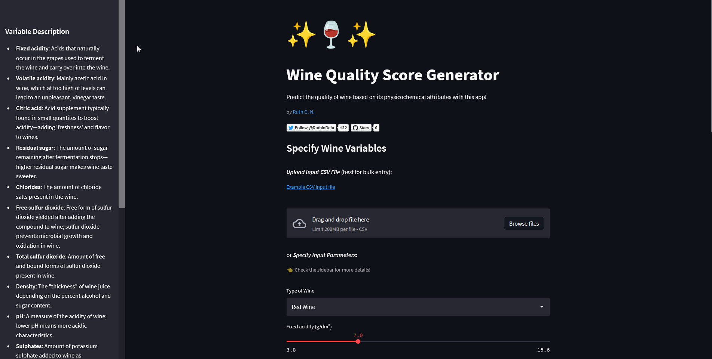

# Wine-Quality-Prediction-App

Demo: [](https://share.streamlit.io/ruthgn/wine-quality-prediction-app/main/wine-quality-ml-app.py)

This app generates wine score based on its physicochemical qualities—with wine score being a measurement of how well it's received and rated by wine experts after a blind taste test. The app demonstrates the deployment of a pre-trained TensorFlow regression model as an interactive web app.

|  | 
|:--:| 
| *Predict the quality of wine based on its physicochemical attributes* |

## Motivation
So much about wine making remains elusive. Winemakers, connoisseurs, and scientists have greatly contributed their expertise to the process, though there is still more to be discovered about the art and science of winemaking. This project was built to gain a better understanding of what makes a good or bad wine according to wine experts' taste-buds and mimick their decision-making process in assessing wine quality.

Deep learning models are often capable enough in detecting and focusing on the most valuable features even with very little guidance from the programmer--they are mostly used in solving high-dimensionality problems. On the other hand, this also means that they excel in cases where humans don't necessarily know **what feature representations are best for a given task**. Given the complexities of how different psychochemical attributes can affect a wine's perceived taste and aroma, DL can be a tremendous tool to help us understand how experts in this field (who also influence the market) make their judgement.


## Model
This app runs on a neural network-based model trained on the [Wine Quality Data Set](https://archive.ics.uci.edu/ml/datasets/Wine+Quality) from UCI. Kaggle notebook outlining the prediction model building process is available [here](https://www.kaggle.com/ruthgn/predicting-wine-quality-deep-learning-approach).


## Data
The model training set contains records related to red and white variants of the Portuguese *Vinho Verde* wine. The data set contains information from 1599 red wine samples and 4898 white wine samples. Due to privacy and logistic issues, there is no data about grape types, wine brand, and wine selling price. A more detailed description of all input variables in the dataset is available [here](https://www.kaggle.com/ruthgn/wine-quality-data-set-red-white-wine).


## Tech Stack
* Python
* NumPy
* pandas
* scikit-learn
* Tensorflow
* Streamlit


## Running The App Locally
Open a command prompt in your chosen project directory. Create a virtual environment with conda, then activate it.
```
conda create -n myenv python=3.9.7
conda activate myenv
```

Clone this git repo, then install the specified requirements with pip.
```
git clone https://github.com/ruthgn/Wine-Quality-Prediction-App
cd Wine-Quality-Prediction-App
pip install -r requirements.txt
```

Run the app.
```
streamlit run wine-quality-ml-app.py
```

## License
This project is licensed under the GNU General Public License - see the [LICENSE](https://github.com/ruthgn/Wine-Quality-Prediction-App/blob/main/LICENSE) file for details.